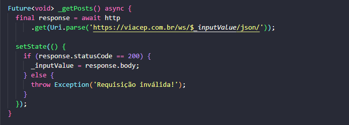

# HTTP Requests in Flutter
## A composable, Future-based library for making HTTP requests.

## Step 1 - add library
### With Dart:
 `dart pub add http`
 
### With Flutter:
 `flutter pub add http`
 
### Now in your Dart code, you can use:

`import 'package:http/http.dart';`

## Step 2 - Requests

This project is a starting point for a Flutter application.

A few resources to get you started if this is your first Flutter project:

- [Lab: Write your first Flutter app](https://docs.flutter.dev/get-started/codelab)
- [Cookbook: Useful Flutter samples](https://docs.flutter.dev/cookbook)

For help getting started with Flutter development, view the
[online documentation](https://docs.flutter.dev/), which offers tutorials,
samples, guidance on mobile development, and a full API reference.
